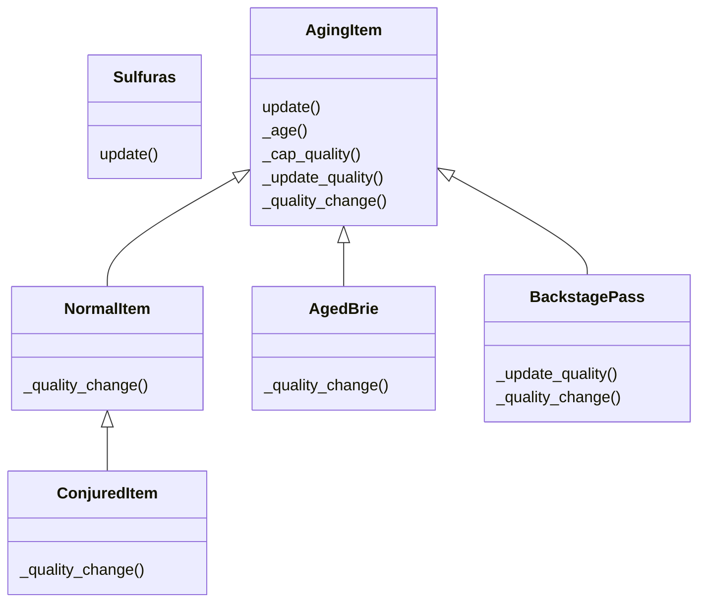

# Gilded Rose Kata in Python
[For Informatics 3 @ Media Informatics HTW Berlin](https://home.htw-berlin.de/~kleinen/info3)

This version of the Gilded Rose Kata is an excerpt compiled from [Emily Bache's repo,](https://github.com/emilybache/GildedRose-Refactoring-Kata)
prepared for usage within [Info3](https://home.htw-berlin.de/~kleinen/info3) in the [International Media Informatics](https://imi-bachelor.htw-berlin.de/) Bachelor at [HTW Berlin](https://www.htw-berlin.de/).

If you look for the Gilded Rose Kata in general, go to the [version published by Emily Bache](https://github.com/emilybache/GildedRose-Refactoring-Kata) or [Kata-Log](https://kata-log.rocks/gilded-rose-kata) for a more general version.

# Instructions for the Kata

You will use this Kata to Practice Work on Legacy Code by 
1. Implementing Characterization Tests

and then implement the new feature using 

2. Refactoring to make the hard change easy and
3. Implementing the Easy Change

## Step by Step

1. Implement Characterization Tests

    a. Read the [Requirements](GildedRoseRequirements.txt)
    
    b. Have a look at the current source code
    
    c. Create Closed Box Tests based on the [Requirements](GildedRoseRequirements.txt) (the specification)
   - if you find behaviour not compliant with the specification, 
     mark the tests with xfail as in the example.

    d. Ensure that you've written 'enough' tests by checking the test coverage

2. Refactor to make the hard change easy
    
    Now that you have a full test suite, you can confidently refactor the source code. Take a moment to consider which new design would make the change easy. Remember that there is one restriction though: **You may not alter the Item class.**
    Which GoF-Patterns would be useful?

3. Implement the Easy Change

    This should be easy now! 

    Did your new design allow for adding the new requirement by just adding new code, without changing existing code?
    (Open-Closed Principle) 
    

## Solutions

This branchs contains three different variants of a refactored gilded rose:

- **gilded_rose.inheritance:** class hierarchy (see diagram below) of item update strategies. makes use of inheritance to define specialisations, which for most items are just in the quality_change - thus update() itself is a quite a template method used by most items.
- **gilded_rose.functional:** update method is defined as a function instead of a strategy class. can't use inheritance here, thus the use of function generators.
- **gilded_rose.registry:** while the first two solutions choose the update method/strategy from a configuration dictionary, this solutions adds a factory with a registry to the inheritance implementation. This combines both strategy selection (is_for) and strategy implementation in the strategy classes.

### testing the different solutions:

the tests take the implementation as a parameter: 

    pytest tests --impl inheritance
    
if you don't provide an implementation, the tests are skipped. The original implementation is also available: 

    pytest tests --impl original

