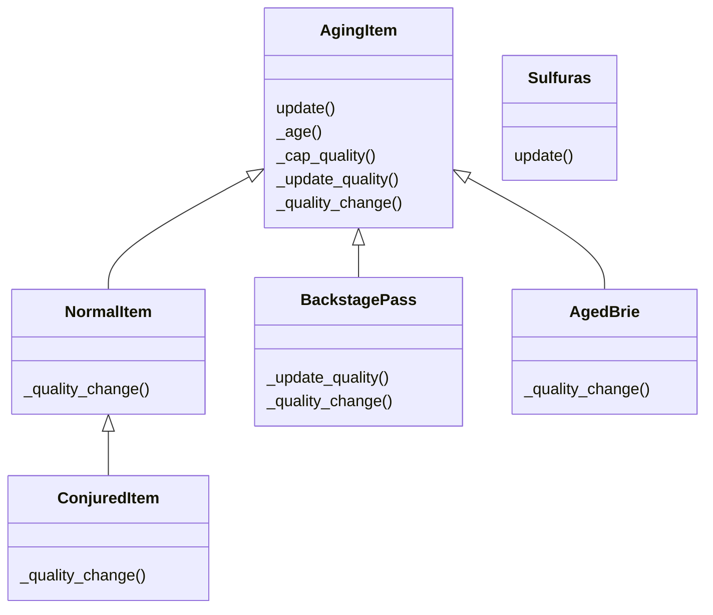

```mermaid
classDiagram
    AgingItem <|-- NormalItem
    NormalItem <|-- ConjuredItem
    AgingItem <|-- BackstagePass
    AgingItem <|-- AgedBrie
  
    class AgingItem{
      update()
      _age()
      _cap_quality()
      _update_quality()
      _quality_change()
    }
    class NormalItem{
      _quality_change()
    }
     class AgedBrie{
      _quality_change()
    }
    class BackstagePass{
      _update_quality()
      _quality_change()
    }
    class ConjuredItem{
      _quality_change()
    }
    class Sulfuras{
        update()
    }
    
```